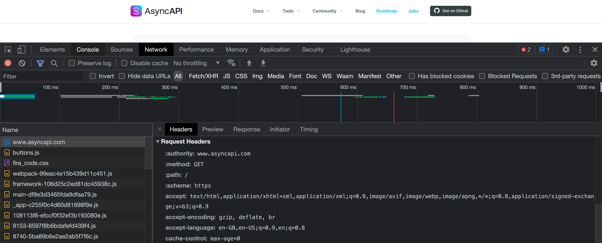
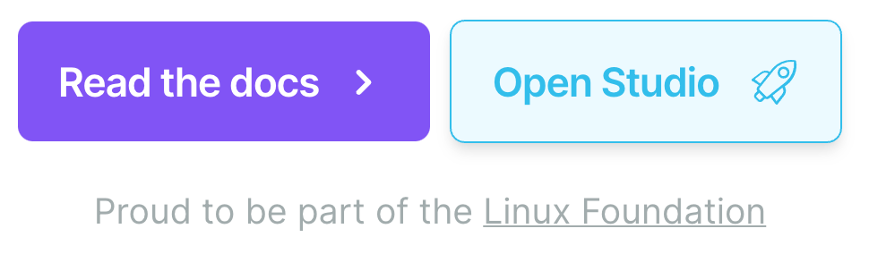
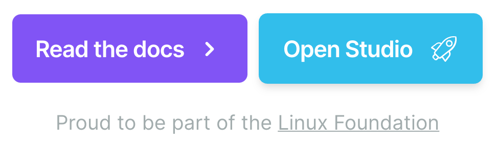

## What is API

It's like a humans conversation interface, but for the digital world.

> At my previous company, we were talking about few Java developers that they have a "heavy interface" -> meaning "they are not most communicative, and close to a cave man"


- Do you like when people call you `Mr/Mrs/Miss/Sir`?
- What is your pronoun?
- Do you care about your titles, should we say `doctor` or `professor`
- Are you in the mood for a talk?
- Do you like to start with small talk?

Wouldn't it be nice to have it documented and publicly available? Oh wait -> [Solid Project](https://solidproject.org/)

## Sync vs Async


## What is a Protocol

Good real-life example is the `dyplomatic protocol`


- New mission establishment
- Credentials handover
- Appointing new representatives

Example protocol implementation is the [United Nations manual of protocol](https://www.un.org/dgacm/en/content/protocol/manual-of-protocol).

On technical side: It is a set of rules that describe how information is transmited.

HTTP protocol on example of [AsyncAPI website](https://www.asyncapi.com/) :



## Specifications

* HTTP protocol:
  * [OpenAPI](https://github.com/OAI/OpenAPI-Specification) for REST API (although 3.1 no longer mentions it)
  * [GraphQL](https://spec.graphql.org/draft/)
* Async-related protocols:
  * [AsyncAPI](https://github.com/asyncapi/spec)
  * [CloudEvents](https://github.com/cloudevents/spec)
  * [Schema Registry](https://github.com/cloudevents/spec/blob/main/schemaregistry/spec.md)

## Event Driven Architecture (EDA)

Q: Why do you do event-driven API, is REST API not enough?

A1: Because I want to know what is happening in real-time without asking for an update constantly.

OR

A2: When you send a message, and definitely do not expect a response.


> there are many other patterns: [Messaging Patterns](https://www.enterpriseintegrationpatterns.com/patterns/messaging/)

## EDA is pretty old

Just look at the browser and `mouseover` event:

 => 


Microservices brought event-driven into `renesance`.
Serverless puts it to the moon.

## EDA protocols

amqp, http, ibmmq, jms, **kafka**, anypointmq, **mqtt**, solace, stomp, **websocket**, mercure

## EDA Docs

- Most complex to document because of different protocols
- Not widely visible as REST API
  - [Programmableweb](https://www.programmableweb.com/category/all/apis) - 24,471 (Async APIs around 170)
  - [RapidAPI](https://rapidapi.com/categories) - Thousands! 
  - [APIs Guru](https://apis.guru/) - 2,529 OpenAPI examples!
- [APITracker](https://www.apitracker.io/specifications/asyncapi) - 7 AsyncAPI examples...
- REMEMBER: spec is not all you need

## EDA Setup - Simplified

> These two perspectives cause some headache in AsyncAPI

* Clients & Server
  <br/>
    ```mermaid
    graph TD
      server1[Server -> ws://flypoland.pl/travel/status]
      user1[Client -> Browser]
      user1 --> server1
      user2[Client -> Mobile]
      user2 --> server1
    ```
  <br/>
* Producers, consumers and message broker in the middle -> `fire and forget`
  <br/>
    **Step 1**
    ```mermaid
    graph TD
      NotificationSubscribeUI[Subscribe-Me-For-Flight-Status UI]
      NotificationSubscribeUI -- HTTP POST --> FlightSubscriberService
    ```
    **Step 2**
    ```mermaid
    graph TD
      server1{mqtt://flypoland.pl:1883}
      NotificationSubscribeUI[Subscribe-Me-For-Flight-Status UI]
      NotificationSubscribeUI -- HTTP POST --> FlightSubscriberService
      FlightSubscriberService[Flight Subscriber Service]
      FlightSubscriberService -- flight/queue --> server1
    ```
    **Step 3**
    ```mermaid
    graph TD
      server1{mqtt://flypoland.pl:1883}
      NotificationSubscribeUI[Subscribe-Me-For-Flight-Status UI]
      FlightMonitorService[Flight Monitor Service]
      NotificationSubscribeUI -- HTTP POST --> FlightSubscriberService
      FlightMonitorService -- flight/status --> server1
      FlightSubscriberService[Flight Subscriber Service]
      FlightSubscriberService -- flight/queue --> server1
      server1 -- flight/queue --> FlightMonitorService
    ```
    **Step 4**
    ```mermaid
    graph TD
      server1{mqtt://flypoland.pl:1883}
      NotificationSubscribeUI[Subscribe-Me-For-Flight-Status UI]
      FlightMonitorService[Flight Monitor Service]
      NotificationSubscribeUI -- HTTP POST --> FlightSubscriberService
      FlightMonitorService -- flight/status --> server1
      FlightNotifierService[User Notifier Service]
      server1 -- flight/status --> FlightNotifierService
      FlightSubscriberService[Flight Subscriber Service]
      FlightSubscriberService -- flight/queue --> server1
      server1 -- flight/queue --> FlightMonitorService
      SMSService[External SMS Service]
      FlightNotifierService -- HTTP POST --> SMSService
    ```
    **Final**
    ```mermaid
    graph TD
        NotificationSubscribeUI[Subscribe-Me-For-Flight-Status UI]
        NotificationSubscribeUI -- HTTP POST --> FlightSubscriberService
      subgraph EDA World
        FlightMonitorService[Flight Monitor Service]
        server1{mqtt://flypoland.pl:1883}
        FlightMonitorService -- flight/status --> server1
        FlightNotifierService[User Notifier Service]
        server1 -- flight/status --> FlightNotifierService
        FlightSubscriberService[Flight Subscriber Service]
        FlightSubscriberService -- flight/queue --> server1
        server1 -- flight/queue --> FlightMonitorService
      end
      SMSService[External SMS Service]
      FlightNotifierService -- HTTP POST --> SMSService
    ```

